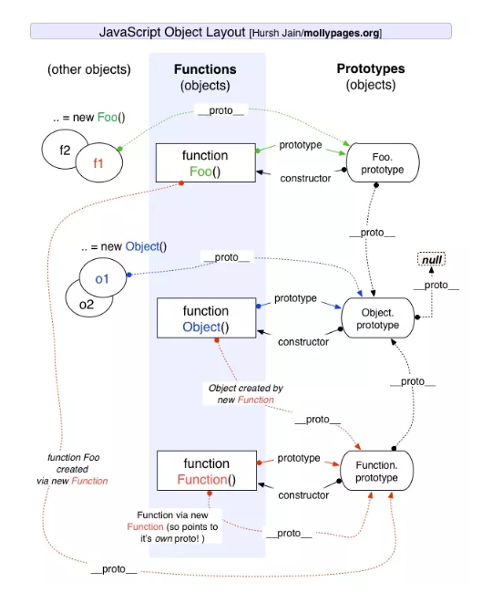

##### 图例


##### 实例化
```javascript
class Foo {};
class Bar {};
const foo = new Foo();
// 实例的 __proto__ 指向类的 prototype
foo.__proto__ = Foo.prototype;

// instanceof 运算符用于检测构造函数的 prototype 属性是否出现在某个实例对象的原型链上
foo instanceof Foo // true
foo instanceof Object // true
foo instanceof Bar // false

// 手写 instanceof
function myInstanceof(obj, targetObj) {
    let left = obj.__proto__;
    const right = targetObj.prototype;
    while(true) {
        if(left === right) { return true; }
        if(left === null) { return false; }
        left = left.__proto__;
    }
}
```

##### 继承
```javascript
class Foo {};
class Baz extends Foo {};
// 子类的 prototype.__proto__ 指向父类的 prototype;
Baz.prototype.__proto__ === Foo.prototype;

// 原型链继承
function Animal(name) {
  this.name = name;
}
Animal.prototype.getName = function() {
    console.log(this.name);
}
function Cat(name) {
  Animal.call(this, name)
}
Cat.prototype = new Animal();
Cat.prototype.constructor = Cat;
```

#####  与原型相关的方法

*   Object.create(proto[, propertiesObject])

    使用指定的原型对象及其属性去创建一个新的对象

    ```javascript
    // propertiesObject 参数可选，对应Object.defineProperties()的第二个参数
    const proto = {};
    const obj = Object.create(proto);
    obj.__proto__ === proto;  // true
    ```

*   Object.getPrototypeOf()

    返回指定对象的原型

    ```javascript
    const proto = {};
    const obj = Object.create(proto);
    Object.getPrototypeOf(obj) === proto;  // true
    ```

    

    