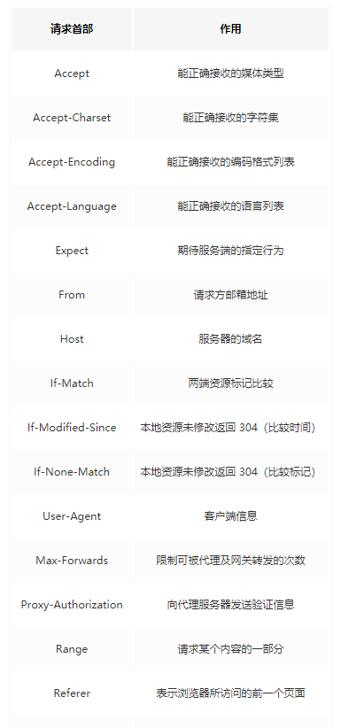

1. #####  箭头函数与普通函数的区别

* 箭头函数是匿名函数，不能用做构造函数，不能使用new关键字

```javascript
const foo = () => {
  console.log('foo')
}
new foo();  // Uncaught TypeError: foo is not a constructor;
```

* 箭头函数不能绑定arguments，取而代之的使用rest参数

```javascript
const foo = () => {
  console.log(arguments);
}
foo(1, 2, 3);  // Uncaught ReferenceError: arguments is not defined;

// 正确使用
const bar = (...c) => {
  console.log(c)
}
bar(1, 2, 3) //[1, 2, 3]
```

* 箭头函数没有原型属性

```javascript
const foo = () => {}
console.log(foo.prototype)  // undefined
```

* 箭头函数不能绑定this，而是补货其在上下文中的this值，作为自己的this值

```javascript
const obj = {
  a: () => {
    console.log(this)  // window
  },
  b: function() {
    console.log(this) // obj
  }
}
```

* 箭头函数的this绑定后不能再修改

```javascript
var a = 'c';
const foo = {
  a: 'a',
  b: function() {
    console.log(this.a)
  }
}

const bar = {
  a: 'a',
  b: () => {
    console.log(this.a)
  }
}

const baz = {
  a: 'c'
}

foo.b.call(baz); // 'c'
bar.b.call(baz); // 'a'
```

2. ##### Ajax原理

    ajax原理就是通过 XMLHttpRequest 对象向服务器发送异步请求，从服务器获取数据，然后用js刷新页面。

    XMLHttpRequest 对象属性

    onreadystatechange   每次状态改变所触发事件的事件处理程序

    responseText               从服务器返回数据的字符串形式  

    responseXml                从服务器返回的DOM兼容的文档数据对象

    status                             从服务器返回的请求状态码

    statusText                     伴随状态码的字符串信息

    readyState                     对象状态值

    1 - 未初始化  对象已建立，但是尚未初始化（尚未调用 open 方法）

    2 - 初始化    对象已建立，尚未调用 send 方法

    3 - 发送数据  send方法已调用，并且头部和状态已经可以获得

    4 - 数据传输中 响应体部分正在被接收

    5 - 完成   请求操作已经完成，此时可以通过 responseText 和 responseXml 获取完整数据

    通过XMLHttpRequest创建请求

    ```javascript
    function request(method = 'get', url, async = true, callback, data) {
      callback = callback || function() {}
      let server = new XMLHttpRequest()
      server.open(method, url, async)
      server.send(data)
      server.timeout = 5000
      server.ontimeout = function() {console.log('请求超时！')}
      server.onreadystatechange = function(res) {
        if(res.readyState === 4 && res.status === 200) {
          callback(res)
        }
      }
    }
    
    post传参方式：
    server.send('name=jack&age=21')
    ```

3. ##### class关键字和构造函数的区别

    * class声明会提升，但不会初始化赋值

    ```javascript
    const bar = new Bar(); // it's ok
    function Bar() {
      this.bar = 42;
    }
    
    const foo = new Foo(); // ReferenceError: Foo is not defined
    class Foo {
      constructor() {
        this.foo = 42;
      }
    }
    ```

    * class的所有方法都是不可枚举的

    ```javascript
    // 引用一个未声明的变量
    function Bar() {
      this.bar = 42;
    }
    Bar.answer = function() {
      return 42;
    }
    Bar.prototype.print = function() {
      console.log(this.bar);
    }
    const barKeys = Object.keys(Bar); // ['answer']
    const barProtoKeys = Object.keys(Bar.prototype); // ['print']
    
    class Foo {
      constructor() {
        this.foo = 42;
      }
      static answer() {
        return 42;
      }
      print() {
        console.log(this.foo)
      }
    }
    const fooKeys = Object.keys(Foo); // []
    const fooProtoKeys = Object.kyes(Foo.prototype); // []
    ```

    * class的所有方法都没有原型对象prototype，也没有[[constructor]]，不能使用new关键子调用

    ```javascript
    function Bar() {
      this.bar = 42;
    }
    Bar.prototype.print = function() {
      console.log(this.bar);
    }
    const bar = new Bar();
    const barPrint = new bar().print(); // it's ok
    
    class Foo {
      constructor() {
        this.foo = 42;
      }
      print() {
        console.log(this.foo);
      }
    }
    const foo = new Foo();
    const fooPrint = new foo().print(); // TypeError: foo.print is not a constructor
    ```

    * 必须使用new关键字调用class

    ```javascript
    function Bar() {
      this.bar = 42;
    }
    const bar = Bar(); // it's ok
    
    class Foo {
      constructor() {
        this.foo = 42;
      }
    }
    const foo = Foo(); // TypeError: class constructor Foo cannot be invoke without 'new'
    ```

4. ##### == 和 === 和 Object.is()

    * ==  和 ===

        

    * === 和 Object.is()

        ```javascript
        -0 === +0  // true
        NaN === NaN  // false
        
        Object.is(-0, +0)   // false
        Object.is(NaN, NaN)  // true
        function is(x, y) {
          if(x === y) {
            // x !== 0 判断 +0 和 -0
            // 1 / x === 1 / y 判断 x===0, y === 0
            return x !== 0 || y !== 0 || 1 / x === 1 / y;
          }else {
            // 判断x、y是否是NaN
            return x !== x && y !== y;
          }
        }
        ```

5. ##### 原型链

    

6. ##### cookie, localStorage, sessionStorage, indexDB

    
    
7.  ##### var, let, const

    <b>1 - let 和 var区别：</b> 

    *   let申明的变量以代码块为作用域，var申明的变量以函数为作用域
    *   let申明的变量存在暂时死区，不能在初始化之前使用
    *   var在全局作用域下申明的变量，都会成为window的属性，let申明的变量不会
    *   let申明的变量不能重复申明

    **2 - let和const的区别：**

    *   必须在const申明变量时就给定初始值

        ```javascript
        var a = 10;
        var a;
        console.log(a);  // 10
        
        类似于
        
        var a;
        var a;
        a = 10;
        console.log(a)
        ```

    <b>3 - 函数提升优先于变量提升，函数提升会把整个函数挪到作用域顶部，变量提升只会把申明挪到作用域顶部</b> 

8.  ##### 事件触发机制

    <b>1 - 事件先由window向事件触发处传播，遇到捕获事件会触发；</b> 

    <b> 2 - 到达事件触发处时触发注册的事件</b> ;

    <b>3 - 再从事件触发处向window传播，遇到冒泡事件触发冒泡事件</b> 。

    通常我们使用 <b>addEventListener</b> 注册事件，该函数的第三个参数可以是布尔值，也可以是对象。对于布尔值 <b>useCapture</b> 参数来说，该参数默认值为false，<b>useCapture</b> 决定了注册事件是捕获事件还是冒泡事件。对于对象参数来说，可以是哟ing以下几个属性：

    <b>capture</b> : boolean，和 <b>useCapture</b> 作用一样

    <b>once</b> : boolean，值为true表示回调只会调用一次，调用后移除监听

    <b>passive</b> : boolean，表示永远不会调用 <b>preventDefault</b> 

    ```JavaScript
    <div class="red" id="red">
      <div class="blue" id="blue">
        <div class="orange" id="orange">
           <div class="green" id="green"></div>
        </div>
      </div>
    </div>
      
    <script>
      const red = document.getElementById('red')
      const blue = document.getElementById('blue')
      const orange = document.getElementById('orange')
      const green = document.getElementById('green')
      
      red.addEventListener('click', function() {
        console.log('red')
      }, true)
      
      blue.addEventListener('click', function() {
        console.log('blue')
      }, false)
      
      orange.addEventListener('click', function() {
        console.log('orange')
      }, true)
      
      green.addEventListener('click', function() {
        console.log('green')
      })
      
      输出结果：
      red
      orange
      green
      blue
      
    </script>
      
    <style>
      .red{
        height: 300px;
        width: 300px;
        background: red;
      }
      .blue{
        height: 200px;
        width: 200px;
        background: #409EFF;
      }
      .orange{
        height: 100px;
        width: 100px;
        background: orange;
      }
      .green{
        height: 50px;
        width: 50px;
        background: green;
      }
    </style>
    ```

9.  ##### HTTP请求

    HTTP请求由三部分组成

    <b>1 - 请求行</b> 

    <b>2 - 首部</b> 

    <b>3 - 实体</b>

    请求行大概是这样：get images/logo.git HTTP/1.1，基本由请求方法、URL、协议版本组成

    get请求和post请求的不同

    <b>1 - get请求能缓存，post不能</b>

    <b>2 - post请求相对安全一点，因为get请求参数会包含在URI里，且会被浏览器保存历史记录，post不会</b> 

    <b>3 - URL会有长度限制，会影响get请求</b> 

    <b>4 - post支持更多的编码类型且不对数据类型限制</b> 

    首部分为请求首部和响应首部

    <b>1 - 通用首部</b> 

    

    <b>2 - 请求首部</b> 

    

    <b>3 - 实体首部</b> 

    

    <b>4 - 常见状态码：</b> 

    

    幂等：指同样的请求执行一次和连续执行多次的效果是一样的。get、put、delete是幂等的，post不是

10.  ##### 深拷贝

    通常可以通过 <b>JSON.parse(JSON.stringify(object))</b> 来解决

    ```javascript
    let a = {   
      age: 1,   
      jobs: {     
        first: 'FE’   
      } 
    }
    let b = JSON.parse(JSON.stringify(a))
    a.jobs.first = 'native'
    console.log(b.jobs.first) // FE
    ```

    但是该方法也是有局限性的：

    <b>1 - 会忽略 undefined</b>  

    <b>2 - 会忽略 symbol </b> 

    <b>3 - 不能序列化函数</b> 

    <b>4 - 不能解决循环引用的问题</b> 

    ```javascript
    // 局限1:
    var obj = {a: 1, b: 2, c: 3, d: undefined};
    console.log(JSON.parse(JSON.stringify(obj)));     // {a: 1, b: 2, c: 3}
    
    // 局限2:
    var obj = {a: 1, b: 2, c: 3, d: Symbol()};
    console.log(JSON.parse(JSON.stringify(obj)));    // {a: 1, b: 2, c: 3}
    
    // 局限3:
    var obj = {a: 1, b: 2, c: 3, d: function() {}};
    console.log(JSON.parse(JSON.stringify(obj)));   // {a: 1, b: 2, c: 3}
    ```

    手写深拷贝

    ```javascript
    function deepClone(obj) {
      const result = {};
      for(const k in obj) {
        const value = obj[k];
        if(typeof value === 'object') {
          result[k] = deepClone(value);
        }else {
          result[k] = value;
        }
      }
      return result;
    }
    ```

    

11.  ##### this的指向

     

12.  ##### 浏览器渲染原理

     

     <b>1 - 解析html，生成dom tree。同时解析css，生成style tree</b> 

     <b>2 - 合并dom tree和style tree，生成render tree</b> 

     <b>3 - 布局render tree，计算各元素的位置和尺寸</b>  

     <b>4 - 绘制render tree，生成图层</b> 

     <b>5 - 将图层交给GPU合成，最后显示出页面</b> 

13.  ##### 浏览器缓存机制

     **DNS解析** 

     将域名解析成IP地址

     ```
     www.baidu.com --> DNS解析 --> 180.101.49.12
     ```

     **DNS缓存** 

     首先搜索浏览器自身的DNS缓存，如果存在，则域名解析到此完成；

     如果浏览器自身缓存里没有找到对应条目，那么会尝试读取操作系统的hosts文件看是否存在对应的映射关系，如果存在，则域名解析到此完成；

     如果hosts文件不存在映射关系，则查找本地DNS服务器，如果存在，域名解析到此完成；

     如果本地DNS服务器还没找到的话，它会向根服务器发出请求，进行递归查询

     ```
     浏览器自身DNS缓存 --> 操作系统的hosts文件看是否有映射关系 --> 查找本地DNS服务器 --> 向根服务器发出请求
     ```

     -   **浏览器缓存** 

         

     -   **memory cache**  

         将资源缓存到内存中，下次访问时不需要重新下载资源，而直接从内存中获取

     -   **disk cache** 

         将资源缓存到磁盘中，下次访问中不需要重新下载资源，而直接从硬盘中获取

     -   **访问缓存的优先级** 

         1 - 先在内存中查找，如果有，直接加载

         2 - 如果内存中不存在，则在硬盘中查找，如果有直接加载

         3 - 如果硬盘中也没有，那么就进行网络请求

         4 - 请求获取的资源缓存到内存和硬盘

14.  ##### 盒模型

     *   **通过box-sizing属性控制盒模型**

         1.  content-box 标准盒模型（默认）

             width = 内容宽度（content的宽度）

         2.  border-box

             width = 内容宽度（content的宽度）+ 内边距（padding）+ 边框（border）

     *   **BFC**

     1.  BFC定义

         BFC直译为“块级格式上下文”，它是一个独立的布局环境，其中的元素布局不受外界的影响，并且在一个BFC中，块级元素和内联元素都会垂直的沿着其父级元素的边框排列

     2.  BFC的布局规则：
         1.  内部的元素会在垂直方向，一个接一个的放置
         2.  元素垂直方向的距离由margin决定。属于同一个BFC的两个相邻元素的margin会发生重叠
         3.  BFC的区域不会与浮动元素重叠
         4.  BFC就是一个隔离的独立容器，容器里面的字元素不会影响到外面的元素，反之也如此。

15. ##### css权重

     1.  常用选择器权重优先级：***!important > id > class > tag\***
     2.  !important可以提升样式优先级，但不建议使用。如果!important被用于一个简写的样式属性，那么这条简写的样式属性所代表的子属性都会被应用上!important。 例如：*background: blue !important;*
     3.  如果两条样式都使用!important，则权重值高的优先级更高
     4.  在css样式表中，同一个CSS样式你写了两次，后面的会覆盖前面的
     5.  样式指向同一元素，权重规则生效，权重大的被应用
     6.  样式指向同一元素，权重规则生效，权重相同时，就近原则生效，后面定义的被应用
     7.  样式不指向同一元素时，权重规则失效，就近原则生效，离目标元素最近的样式被应用